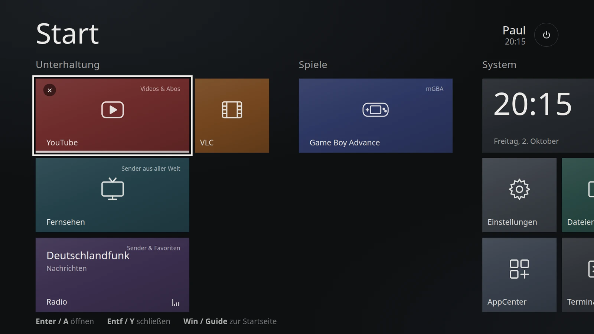
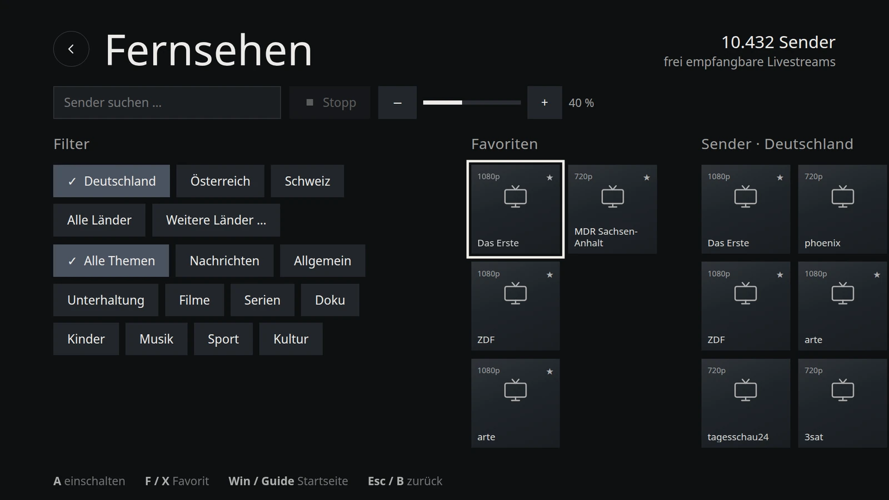
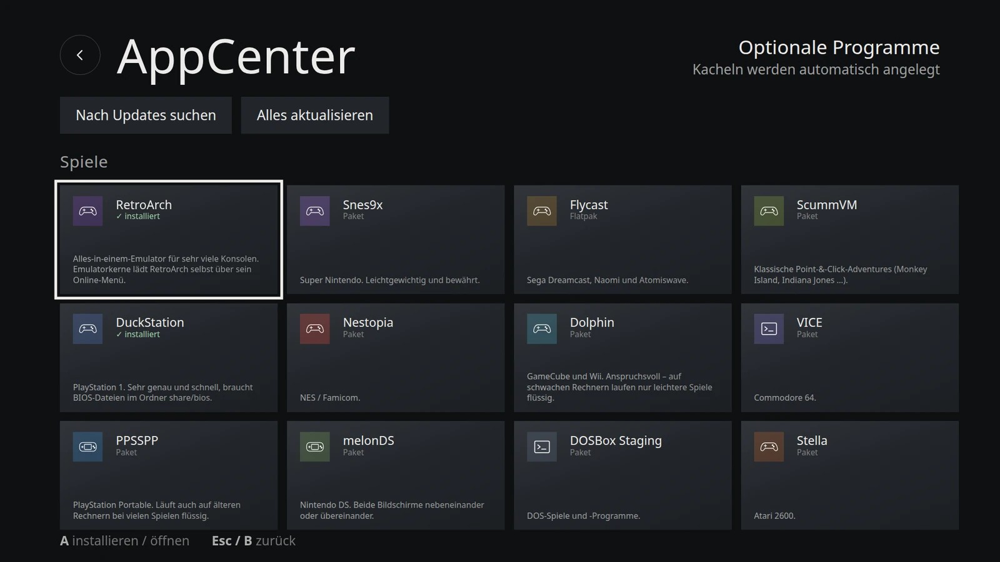
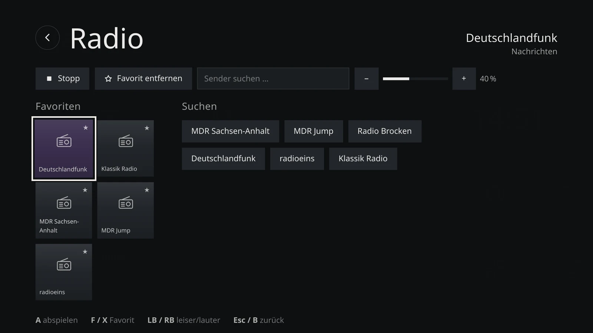

# VoidStation

Void Linux als TV-Station: Kacheloberfläche im Stil von Windows 8, dunkel, bedienbar mit Maus, Tastatur und Gamepad.
Läuft auf Openbox; die Startseite ist ein eigenes Programm in Python + Qt 6, das direkt auf der Grafikkarte zeichnet.
Auch der Installer im Live-System ist Qt. Die bisherige Web-Oberfläche (WebKitGTK) bleibt als Rückfall umschaltbar (Einstellungen → System → Oberfläche).

**Funktionen:** YouTube (Firefox im Kiosk-Modus), Radio mit Suche und Favoriten, TV-Sender aus aller Welt (iptv-org),
Emulatoren, AppCenter für optionale Apps (xbps, Flatpak, AppImage, Web), Einstellungen (Sprache, Skalierung, Auflösung,
Tonausgang, WLAN, Mauszeiger), Samba-Freigabe `\\<rechner>\share`, mehrere Apps parallel mit Umschalten.
Oberfläche auf **Deutsch oder Englisch** (Einstellungen → Sprache · Language).
Grafik-Server ist [XLibre](https://github.com/X11Libre/xserver) (Pakete von [xlibre-void](https://github.com/xlibre-void/xlibre));
X.Org wird nicht verwendet. Startet die Oberfläche zweimal nicht, installiert VoidStation XLibre einmal neu;
danach folgt eine Rettungskonsole. Von Hand: `sudo /usr/local/sbin/voidstation-pkg xserver ensure|repair|status`.
Fernzugriff per SSH lässt sich unter Einstellungen → System ein- und ausschalten.



| Fernsehen | AppCenter | Radio |
|---|---|---|
|  |  |  |

## Neuinstallation (ganze SSD, von der offiziellen Void-ISO)

1. Offizielle Void-Base-ISO (x86_64, glibc) auf einen Stick oder Ventoy-Stick kopieren. Im BIOS Secure Boot ausschalten und vom Stick booten (UEFI oder BIOS/Legacy).
2. Als `root` mit Passwort `voidlinux` anmelden, dann:

```sh
loadkeys de
xbps-fetch https://panther92.github.io/VoidStation/vs
bash vs
```

`vs` ist ein kleiner Starter (`docs/vs`, veröffentlicht über GitHub Pages aus dem Zweig `stable`, Ordner `/docs`):
Er lädt jedes Mal den aktuellen `dist/voidstation-install.sh` aus diesem Repo und startet ihn.
Lange Variante ohne Starter:
`xbps-fetch https://raw.githubusercontent.com/Panther92/VoidStation/stable/dist/voidstation-install.sh`

Das Skript fragt Ziel-SSD, Rechnername, Name und Passwort ab. **Es löscht die komplette SSD.**
Danach installiert es Void, VoidStation, EFISTUB (GRUB als Rückfall) und die Samba-Freigabe.
Grafiktreiber für Intel, AMD oder NVIDIA (nouveau) wählt es automatisch.

## Auf ein bestehendes Void

```sh
sudo bash install.sh              # Erstinstallation
sudo EFISTUB=1 bash install.sh    # zusätzlich direkt per EFISTUB booten
sudo bash update.sh               # Aktualisieren, eigene Kacheln/Favoriten bleiben
```

## Updates

**Am Fernseher:** Einstellungen → Updates → *Aktualisieren* – der einzige Update-Knopf. Er prüft und installiert
alles in einem Durchgang: Void-Pakete (inkl. Kernel), Flatpaks, AppImages, Proton-GE und VoidStation selbst
(in dieser Reihenfolge; was aktuell ist, wird übersprungen). Die Geräte prüfen kurz nach dem Start und dann alle
6 Stunden selbst. Neue VoidStation-Versionen zeigt unten rechts sofort ein Hinweis – das Update bringt wartende
Systemupdates gleich mit. Reine Systemupdates meldet der Hinweis erst, wenn das System seit 30, 60 oder 90 Tagen
nicht mehr aktuell war (Einstellungen → Updates → *Systemupdates melden nach*, Standard 90). Der Update-Dialog zeigt, was neu ist und welche Pakete
kommen. Eigene Kacheln, Favoriten und Einstellungen bleiben erhalten. Ein Neustart wird nur verlangt, wenn ein
neuer Kernel oder eine neue VoidStation-Version installiert wurde.

**Im Terminal:** `vsctl update` macht dasselbe wie der Knopf (Protokoll läuft mit). `sudo xbps-install -Su`
aktualisiert nur die Void-Pakete – das geht weiterhin, VoidStation erkennt es (erledigte Updates verschwinden aus
der Anzeige, nach einem neuen Kernel steht „Neustart nötig“ unten rechts). VoidStation selbst ist kein
xbps-Paket und kommt nur über den Knopf bzw. `vsctl update`.

**Kanäle:** *Stable* (Zweig `stable`, Standard) oder *Testing* (Zweig `main`, neue Versionen zuerst) –
umschaltbar unter Einstellungen → Updates → Update-Kanal.

**Signaturen:** Updates laufen als root, deshalb installieren Geräte nur Updates, die mit dem Schlüssel des
Herausgebers signiert sind (`ssh-keygen -Y`, Namensraum `voidstation`). Der öffentliche Schlüssel liegt in
`keys/voidstation-release.pub` und wird bei der Installation hinterlegt. Die allererste Installation vertraut
HTTPS und diesem Repo.

## Veröffentlichen (Herausgeber)

Gebaut und signiert wird auf dem Rechner des Herausgebers mit `tools/publish.sh` – dort liegt der private Schlüssel.

```sh
git config --global credential.helper store      # einmalig: GitHub-Zugang (Token) merken
echo "alias vspub='bash ~/VoidStation/tools/publish.sh'" >> ~/.bashrc   # einmalig, dann neu anmelden
vspub --init-key                                 # einmalig: Signaturschlüssel anlegen (Sicherungskopie!)
vspub                                            # Bundle aus ~/share/Updates übernehmen, bauen, signieren,
                                                 # nach main (Kanal Testing) pushen
vspub --release                                  # Test-Stand für alle freigeben (stable)
vspub --iso                                      # neueste Live-ISO aus ~/share/ISO nach SourceForge
```

`vspub --iso` prüft die Prüfsumme der ISO, signiert die `.sha256` mit dem Release-Schlüssel (`.sha256.sig`),
lädt alles per rsync nach `frs.sourceforge.net:/home/frs/project/voidstation/<version>/` (ein Abbruch setzt beim
nächsten Aufruf fort), stellt den Download auf voidstation.de um (`site/config.json`) und löscht die ISO danach
lokal. Am besten in `tmux` starten. Einmalig nötig: SSH-Schlüssel bei SourceForge hinterlegen und in `~/.ssh/config`
eintragen (`Host frs.sourceforge.net` · `User <SourceForge-Name>` · `IdentityFile ~/.ssh/sourceforge`).
Danach im Browser die ISO als *Default Download* markieren.

Neue Versionen bekommen einen Eintrag oben in `CHANGELOG.md` (`## 0.4.1 – JJJJ-MM-TT` plus Stichpunkte)
und denselben Eintrag auf Englisch in `CHANGELOG.en.md` – fehlt er, bricht `build.sh` ab.
`dist/` wird nur von `publish.sh` erzeugt und nicht von Hand geändert.
Forks tragen ihre eigene Adresse in `update-url` ein und legen einen eigenen Schlüssel an.
Ist ein Remote `codeberg` eingerichtet, pflegt `publish.sh` ihn als Spiegel mit (früherer Standort des Projekts).

## Webseite (voidstation.de)

Die Webseite liegt in `site/` und wird mit `tools/build-site.py` gebaut (nur Python 3, keine Fremdpakete).
GitHub Actions (`.github/workflows/pages.yml`) baut und veröffentlicht sie bei jedem Push nach `main` oder `stable` –
`vspub` reicht also, um sie zu aktualisieren.

- **Seiten:** `site/pages/<seite>.de.md` und `.en.md` (Markdown, erste Zeile `# Titel`, erster Absatz = Vorspann).
  Links auf andere Seiten als `seite:hilfe#bedienung`; Bausteine wie `{{iso}}` stehen allein in einer Zeile.
- **News:** jede Version aus `CHANGELOG.md`/`CHANGELOG.en.md` des Zweigs `stable` erscheint automatisch.
  Eigene Beiträge: `site/news/JJJJ-MM-TT-name.de.md` (+ `.en.md`), erste Zeile `# Titel`.
- **ISO-Download:** Version, Adresse, Größe und SHA-256 in `site/config.json` unter `iso` eintragen.
- **Impressum:** `site/impressum.json`. Solange Name und E-Mail fehlen, veröffentlicht der Workflow nur eine
  Baustellenseite (plus `/vs` und die Update-Kanäle). Die Anschrift (`street`, `city`) ist optional und erscheint, sobald sie eingetragen ist.
- Unter der Domain liegen außerdem `/vs` (Install-Starter aus `stable`), `/stable/dist/` und `/main/dist/`.

Ansehen ohne Veröffentlichen:

```sh
python3 tools/build-site.py --preview      # --preview zeigt alles, auch ohne Impressum
python3 -m http.server -d _site 8000       # dann http://<rechner>:8000
```

## Live-ISO mit Installer

Die Live-ISO ist eine komplette VoidStation zum Ausprobieren (YouTube, Fernsehen, Radio, VLC) mit der Kachel
**VoidStation installieren**. Der Installer läuft im selben Kacheldesign, auf Deutsch oder Englisch, und kopiert
das Live-System auf die SSD – dafür braucht er kein Internet.

- **Wege:** ganze SSD · neben Windows oder Linux (NTFS, ext4 oder btrfs wird verkleinert) · in freien Platz
  (z. B. neben FreeBSD) · selbst einteilen mit GParted. Bei mehreren Systemen gibt es ein kurzes GRUB-Startmenü;
  neben Windows läuft die Hardware-Uhr auf Ortszeit.
- **Mindestens:** 64-Bit-PC, 4 GB RAM, 16 GB auf der SSD, Secure Boot aus. Fehlt etwas, sagt der Installer, was zu tun ist.
- **Startmodus:** UEFI kann alle Wege. Im BIOS-Modus (Legacy/CSM, z. B. ältere PCs oder VirtualBox/QEMU mit
  Standardeinstellungen) gibt es nur „ganze SSD“: GPT mit BIOS-Boot-Partition, GRUB für BIOS und zusätzlich
  für UEFI – die SSD startet danach in beiden Modi.
- **Startmenü des Sticks:** mit Logo – oben die Sprache (*Deutsch* / *English*, stellt Oberfläche, Installer und Tastatur ein),
  darunter je *VoidStation Live starten* (freie Treiber) und *… (nur NVIDIA)* bzw. *Start VoidStation Live* / *… (NVIDIA only)*
  (NVIDIA-Treiber für GeForce GTX 16xx / RTX 20xx und neuer) · *Reboot*. Beim Hochfahren zeigt ein Startbild das Logo.
  Wer über „NVIDIA only“ installiert, bekommt den NVIDIA-Treiber auch im installierten System – sonst entfernt der
  Installer ihn wieder (samt DKMS und Compiler).
- **Fehler:** Jeder Schritt lässt sich wiederholen, der Startmanager auch „anders“ (Standard-Starter statt NVRAM-Eintrag).
  Protokoll: `/run/voidstation-installer/install.log`, lässt sich auf einen USB-Stick speichern.
- **Terminal:** `sudo voidstation-installer text` (nur ganze SSD) · `probe` zeigt, was der Installer erkennt.

Bauen auf einem Void-System (z. B. einer VoidStation), dauert 25–50 Minuten:

```sh
sudo bash dist/build-iso.sh
```

Die ISO landet unter `~/share/ISO/` (mit `.sha256`), eigene Radio- und TV-Favoriten kommen mit.
Auf einen Ventoy-Stick kopieren oder mit Rufus/balenaEtcher schreiben.

**Download prüfen:** Neben jeder ISO auf SourceForge liegen `.sha256` und die Signatur `.sha256.sig`.

```sh
sha256sum -c voidstation-<version>-<datum>.iso.sha256
curl -fsSL https://raw.githubusercontent.com/Panther92/VoidStation/stable/keys/voidstation-release.pub \
  | awk '{print "voidstation-release namespaces=\"voidstation\" "$1" "$2}' > voidstation-signers
ssh-keygen -Y verify -f voidstation-signers -I voidstation-release -n voidstation \
  -s voidstation-<version>-<datum>.iso.sha256.sig < voidstation-<version>-<datum>.iso.sha256
```

## Bedienung

| | Controller | Tastatur | Maus |
|---|---|---|---|
| Bewegen | Steuerkreuz / linker Stick | Pfeiltasten | zeigen, Mausrad blättert |
| Öffnen / Auswählen | A | Enter | Klick |
| Zurück | B | Esc / Rücktaste | Rechtsklick |
| Programm schließen, Favorit | X / Y | Entf, F, Y | ✕ auf der Kachel |
| Gruppe vor / zurück | RT / LT | Bild ↓ / Bild ↑ | Pfeile oben rechts |
| Leiser / lauter | LB / RB | − / + | |
| Update öffnen (wenn unten rechts angezeigt) | Select | U | Klick auf den Hinweis |
| Ausschalten | Start | – | ⏻ oben rechts |
| Zurück zur Startseite (aus jedem Programm) | Guide / Home | Win | |

Die Pfeile oben rechts erscheinen, sobald eine Seite breiter als der Bildschirm ist; der helle Punkt zeigt die aktuelle Gruppe.
Warten Updates (oder ist nach einem neuen Kernel ein Neustart nötig), steht unten rechts ein gelber Hinweis.

## Sprachen

Alle Texte der Oberfläche stehen in `launcher/web/i18n/de.json` und `en.json` (Schlüssel → Text, `{name}` = Platzhalter).
Im Code: `T('schlüssel', { name })` für Texte, `L(text)` für Kachel-, Gruppen- und App-Namen.
Neue Texte gehören immer in **beide** Dateien – `build.sh` bricht ab, wenn in `en.json` ein Schlüssel oder Platzhalter fehlt.

- Sprache wählen: Einstellungen → Sprache · Language. Ohne Wahl gilt `LANG` der Sitzung (`en_US…` → Englisch, sonst Deutsch).
- Programme aus den Kacheln starten mit `LANG`/`LANGUAGE` der gewählten Sprache (VLC, PCManFM, GTK/Qt); Firefox-Profile bekommen
  vor jedem Start `intl.locale.requested` und `intl.accept_languages`. Programme mit eigener Spracheinstellung (Steam, Kodi) bleiben dabei.
- Kacheln: Deutsche Standardnamen (z. B. „Fernsehen“) übersetzt `labels` in `en.json`; eigene Namen bleiben, wie sie sind.
  Eigene Kacheln können auch zweisprachig sein: `"label": {"de": "Fernsehen", "en": "TV"}`.
- AppCenter: Beschreibungen über `app.<id>.desc` in `en.json`, sonst gilt der Text aus `catalog.json`; Hinweise nach der
  Installation (`note` im Katalog) über `app.<id>.note`. Kategorien kommen aus `categories` in `catalog.json` (Reihenfolge =
  Seitenleiste, Name über `labels`, Untertitel über `apps.catDesc.<Kategorie>`); „Installiert“ baut die Oberfläche selbst.
- Englisch heißt `en_US`: 12-Stunden-Uhr (8:15 PM), Datum und Zahlen im US-Format.
- Screenshots der englischen Oberfläche: `VS_LANG=en python3 tools/screenshots.py`.

## Themes & Designs

Unter **Einstellungen → Design → Farbschema** stehen verschiedene Themes zur Auswahl (z. B. `Dunkel`, `Hell`, `Hoher Kontrast`, `Nord`). Das gewählte Theme wird in `settings.json` gespeichert und bleibt bei Updates erhalten.

### Eigene Themes hinzufügen (Drop-in)
Neue Themes können als CSS-Datei direkt in `launcher/web/themes/<theme-name>.css` abgelegt werden:

```css
/* launcher/web/themes/matrix.css */
:root[data-theme="matrix"] {
  --bg-main: #051008;
  --bg-radial-1: #0d2814;
  --bg-radial-2: #020a04;
  --surface-base: #0a1f10;
  --surface-raised: #10331b;
  --surface-card: #143d20;
  --surface-card-hover: #1c542c;
  --surface-active: #00ff66;
  --text-primary: #a3ffc2;
  --text-secondary: rgba(163, 255, 194, 0.75);
  --border-focus: #00ff66;
  --border-subtle: #1c542c;
  /* ... */
}
```

VoidStation erkennt neue CSS-Dateien im Theme-Ordner automatisch und bietet sie direkt in den Einstellungen an.

## Spiele, Bluetooth, Programmvorschau

- **Spiele:** ROMs in die Freigabe unter `share/ROMs/<System>` kopieren (`gba`, `snes`, `nes`, `psx`, `psp`, `nds`, `gamecube`, `dreamcast` …). Die Emulator-Kachel zeigt dann eine Spieleliste; ohne Spiele startet der Emulator direkt.
- **Bluetooth:** Einstellungen → Bluetooth. Bringt `bluez` und `libspa-bluetooth` (Ton über PipeWire) mit; der Benutzer ist in der Gruppe `bluetooth` – nach der Installation bzw. dem Update einmal neu starten.
- **Programmvorschau (EPG):** standardmäßig aus. Einschalten, indem man die Adresse einer XMLTV-Datei (`.xml` oder `.xml.gz`) einträgt:
  `echo 'https://…/epg.xml.gz' | sudo tee /usr/local/share/voidstation/epg-url`
  Die Datei wird täglich geladen, im Hintergrund eingelesen und als kleine `~/.local/share/voidstation/cache/epg.json` zwischengespeichert.

## Aufbau

| Pfad | Inhalt |
|---|---|
| `launcher/launcher.py` | Backend: HTTP-API auf 127.0.0.1:8765, Apps starten/umschalten, Radio, TV, AppCenter, Einstellungen |
| `launcher/qt/` | Startseite (Python + Qt 6): `voidstation-home.py` (Fenster, Gamepad, Texte, Farben), `qml/` (Oberfläche), `icons.py` |
| `launcher/web/index.html` | Web-Oberfläche (Kacheln, Radio, TV, AppCenter, Einstellungen, Installer) – Rückfall, falls Qt nicht startet |
| `launcher/web/themes/` | Themes als modulare CSS-Dateien (`default-dark`, `default-light`, `high-contrast`, `nord`) – gelten für beide Oberflächen |
| `launcher/web/i18n/` | Texte beider Oberflächen: `de.json`, `en.json` |
| `launcher/voidstation-shell.py` | Vollbild-Fenster (WebKitGTK) für die Web-Oberfläche; Firefox als Rückfall |
| `launcher/home.sh` | wählt die Oberfläche (Datei `frontend`: `qt` oder `web`) und hält sie am Leben |
| `launcher/tiles.json` | Standard-Kacheln |
| `launcher/catalog.json` | App-Katalog für das AppCenter |
| `launcher/voidstation-pkg` | root-Helfer, installiert nur freigegebene Pakete |
| `launcher/openbox/`, `launcher/firefox/` | Openbox-Konfiguration, Firefox-Profile und Richtlinien |
| `install-head.sh`, `update-head.sh` | Kopf der Installations- und Update-Skripte (Payload wird angehängt) |
| `docs/` | Screenshots und der Starter `vs` (GitHub Pages) |
| `launcher/voidstation-installer` | Installer (root, nur im Live-System): prüft das Gerät, partitioniert, kopiert, richtet ein |
| `iso/` | ISO-Bau (`build-iso-head.sh`, `postsetup.sh`, Startmenü) und Neuinstallation von der offiziellen Void-ISO (`voidstation-install`) |
| `tools/` | `publish.sh` (Bundle einspielen und pushen), `qt-preview.py` (Qt-Startseite mit Beispieldaten ausprobieren), `screenshots.py` (README-Bilder), `boot-art.py` (Grafiken für Startmenü und Startbild → `iso/art/`) |
| `site/`, `tools/build-site.py` | Webseite voidstation.de (Quellen und Bau), veröffentlicht von `.github/workflows/pages.yml` |
| `update-url` | Update-Quelle der Geräte (`{channel}` = stable/main) |
| `CHANGELOG.md`, `CHANGELOG.en.md` | Versionsnummer und Änderungen, deutsch und englisch (erscheinen im Update-Dialog) |
| `keys/` | öffentlicher Signaturschlüssel |
| `dist/` | **fertige Skripte**, erzeugt mit `./build.sh` |

Zum Ausprobieren ohne Veröffentlichung: `OUT=/tmp/vs ./build.sh`.
Qt-Startseite ohne Void ausprobieren: `python3 tools/qt-preview.py` (braucht `pip install PySide6-Essentials`), Installer: `--live` (dazu `--fail` für die Fehlerseite, `--bios` für den BIOS-Modus).
Screenshots neu erzeugen (mit Beispieldaten, ohne Void): `python3 tools/screenshots.py`
(braucht `pip install playwright pillow` und `playwright install chromium`).

## Auf dem Gerät

- Kacheln anpassen: `~/.local/share/voidstation/tiles.json`
- Logs: `~/.local/share/voidstation/logs/`
- Oberfläche wechseln: Einstellungen → System → Oberfläche (oder per SSH: `echo web > ~/.local/share/voidstation/frontend; pkill -f voidstation-home.py`)
- Web-Oberfläche über Firefox statt WebKit: `touch ~/.local/share/voidstation/use-firefox`

## Lizenz

VoidStation steht unter der GNU General Public License v3.0 oder später (GPL-3.0-or-later), siehe [LICENSE](LICENSE).
Mitinstallierte Fremdsoftware (Void-Pakete, Bibata-Mauszeiger, Proton-GE, …) behält ihre eigenen Lizenzen.
